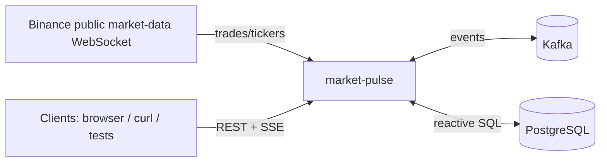
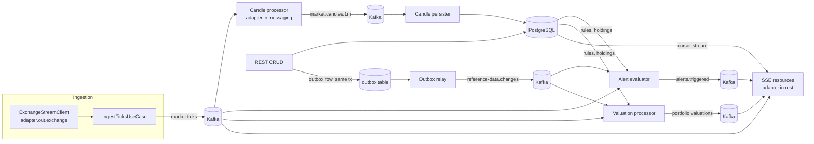

# Architecture

## 1. Goals and non-goals

**Goals**
- Demonstrate reactive end-to-end processing (Mutiny, backpressure, cancellation) on Quarkus / Java 25 (ADR-0007).
- Demonstrate event-driven architecture with Kafka: ingestion, stream processing, fan-out, outbox.
- Combine three data sources into live client streams: external push stream (exchange), Kafka, PostgreSQL.
- Show a deliberate, documented boundary where virtual threads are the better tool (ADR-0002).

**Non-goals**
- Trading, order execution, real money, authentication beyond a simple demo user header.
- Exactly-once semantics across the system (at-least-once + idempotency is the model).
- Horizontal scaling of stateful aggregation beyond Kafka partition ownership (ADR-0004).

## 2. Context

## 3. Components and flows

### 3.1 Ingestion
- `TickIngestionService` (application) starts on CDI `Startup`, takes `Multi<Tick>` from the
  `MarketDataSource` port for the configured symbols (`market-pulse.exchange.symbols`) and publishes each tick
  through the `TickPublisher` port. `market-pulse.source` selects the source at runtime (`MarketDataSourceProducer`):
  - `binance`: `BinanceMarketDataSource` (WebSockets Next client) connects to `{ws-url}/ws`, sends `SUBSCRIBE`
    for `<symbol>@trade` and maps frames to `Tick` (`BinanceTradeMapper`; invalid frames are skipped).
  - `simulator`: `SimulatedMarketDataSource`, a random walk per symbol at `simulator.ticks-per-second`. Used by
    the `test` profile and for offline work (`-Dquarkus.profile=dev,simulator`).
- The connection is expected to drop (exchange closes connections after ~24 h, network failures). A close, an
  error, or no frame for `exchange.stale-timeout` (half-open connection, e.g. after the host slept) fails the
  connection's `Multi`; `retry().withBackOff(initial, max).withJitter(j)` reconnects and resubscribes.
  Mutiny's backoff does not reset after a successful connection, so after several drops reconnects wait up to
  `max-backoff`.
- Readiness check `exchange-connection`: UP while connected (always UP with the simulator); its data shows the
  state, the number of connects and the time of the last frame.
- Ticks are emitted to `market.ticks` keyed by symbol (`KafkaTickPublisher`, channel `market-ticks`). At most
  `ingestion.max-in-flight` publishes wait for acknowledgement; when all are busy, newly arriving ticks are
  dropped and counted (`onOverflow().drop()`) rather than buffered (ticks are superseded quickly; candles stay
  correct enough for a demo). A failed publish is counted and skipped; ingestion continues.

### 3.2 Stream processing (Kafka consumers, shared consumer groups)
- **Candles**: aggregate ticks into 1-minute OHLCV per symbol (`domain.CandleAggregator`, pure Java).
  State is in memory per partition; a candle is emitted when its window closes. On rebalance the open
  window is lost — accepted (ADR-0004).
- **Candle persister**: writes closed candles to `candle` table (idempotent upsert on symbol + open time).
- **Alerts**: evaluates `AlertRule`s (cached, loaded from DB at startup, refreshed from
  `reference-data.changes`) against ticks. Emits `AlertTriggered` with cooldown to avoid alert storms.
- **Valuations**: keeps holdings per portfolio (cached like rules) and latest price per symbol; emits a
  `PortfolioValuation` at most once per second per portfolio.

### 3.3 Client streams (SSE)
- Live fan-out consumers use a **per-instance group id** (`market-pulse-live-${instance}`) with
  `auto.offset.reset=latest`, so every instance sees every event, and a `BroadcastProcessor`/shared
  `Multi` fans out to connected clients.
- Each client subscription is filtered and **bounded per client** (sampling/throttling or
  `onOverflow().drop()`), so one slow client cannot affect others or the consumer.
- Cancellation (client disconnect) must release the subscription immediately.
- Historical + live stream: `/candles/{symbol}/stream` first streams history from PostgreSQL using a
  **server-side cursor** (reactive PG client `RowStream` → `Multi`, real backpressure), then continues with
  live candles from Kafka, de-duplicated by open time.

### 3.4 Reference data and outbox (ADR-0005)
- Portfolios, holdings and alert rules are CRUD via REST, persisted with Hibernate Reactive.
- Every change writes an outbox row in the same transaction. Phase 1: a reactive relay polls the outbox
  (`FOR UPDATE SKIP LOCKED`) and publishes to `reference-data.changes`. Phase 2 (optional): replace the relay
  with Debezium CDC without changing consumers.

### 3.5 Virtual-thread boundary (ADR-0002)
- `GET /api/reports/portfolios/{id}` builds a report using a blocking REST client (exchange 24h statistics)
  and runs `@RunOnVirtualThread`. It exists to contrast the two models; it is the only blocking endpoint.

## 4. REST API

| Method | Path | Type | Notes |
|---|---|---|---|
| GET | `/api/prices/stream?symbols=BTCUSDT,ETHUSDT&maxRate=5` | SSE `Multi<PriceUpdate>` | live, sampled per client |
| GET | `/api/candles/{symbol}/stream?from=<ISO instant>` | SSE `Multi<Candle>` | DB history (cursor) then live |
| GET | `/api/portfolios/{id}/valuation/stream` | SSE `Multi<Valuation>` | live, max 1/s |
| GET | `/api/alerts/stream?portfolioId=` | SSE `Multi<Alert>` | live |
| CRUD | `/api/portfolios`, `/api/portfolios/{id}/holdings` | `Uni` | emits outbox events |
| CRUD | `/api/alert-rules` | `Uni` | emits outbox events |
| GET | `/api/reports/portfolios/{id}` | `@RunOnVirtualThread` | deliberate blocking contrast |
| GET | `/q/health`, `/q/metrics`, `/q/openapi`, `/q/swagger-ui` | Quarkus | ops |

Errors: RFC 7807 `application/problem+json` (`ProblemExceptionMappers`): validation errors → 400 with
`violations[{field, message}]`; `WebApplicationException` → its status; anything else → 500 with a logged
reference id and no internals. SSE streams send a final error event before completing on server-side failure.

## 5. Kafka topics

| Topic | Key | Payload | Producer | Consumers | Partitions (dev) |
|---|---|---|---|---|---|
| `market.ticks` | symbol | `TickEvent` v1 | ingestion | candles, alerts, valuations, live SSE | 6 |
| `market.candles.1m` | symbol | `CandleEvent` v1 | candle processor | persister, live SSE | 6 |
| `alerts.triggered` | portfolioId | `AlertTriggeredEvent` v1 | alert evaluator | live SSE | 3 |
| `portfolio.valuations` | portfolioId | `ValuationEvent` v1 | valuation processor | live SSE | 3 |
| `reference-data.changes` | aggregateId | `ReferenceDataChanged` v1 | outbox relay | alerts, valuations | 3 |
| `<topic>.dlq` | original | original + error headers | SmallRye DLQ strategy | manual inspection | 1 |

Conventions: JSON payloads, event records carry `eventId` (UUID, for idempotency), `occurredAt`, `version`.

`TickEvent` v1: `{"eventId": "<uuid>", "version": 1, "occurredAt": "<trade time, ISO-8601>", "symbol": "BTCUSDT",
"price": "62012.34000000", "quantity": "0.00150000"}`. Price and quantity are strings to keep the exchange scale.
At-least-once delivery; consumers are idempotent.

## 6. Data model (PostgreSQL)

`portfolio`, `holding`, `alert_rule`, `alert` (history), `candle` (PK symbol + open_time), `outbox`.
Owned exclusively by this service; schema via Flyway only (`V1__init.sql`).

| Table | Key | Notes |
|---|---|---|
| `portfolio` | `id` uuid | `owner` (demo user header value), `name`, `created_at`, `updated_at`, `version` (optimistic lock) |
| `holding` | `id` uuid | FK `portfolio_id` (cascade), `symbol`, `quantity > 0`; unique `(portfolio_id, symbol)` |
| `alert_rule` | `id` uuid | FK `portfolio_id` (cascade), `symbol`, `type`; `threshold` for `PRICE_*`, `percent` + `window_seconds` for `PERCENT_CHANGE` (check constraint); `cooldown_seconds` (default 60), `enabled` |
| `alert` | `id` uuid | `event_id` unique (idempotent insert), FK `rule_id` (set null on delete, history survives), FK `portfolio_id` (cascade), `symbol`, `price`, `triggered_at` |
| `candle` | `(symbol, open_time)` | `close_time`, OHLC, `volume >= 0`, `trade_count`; check `low <= open, close <= high` |
| `outbox` | `id` uuid (= eventId) | `aggregate_type`, `aggregate_id`, `event_type`, `payload` jsonb, `occurred_at`, `published_at` (null = pending; partial index) |

Prices and quantities are unconstrained `numeric` (keeps the exchange scale); symbols are checked uppercase;
times are `timestamptz`.

## 7. Cross-cutting
- **Configuration**: `@ConfigMapping(prefix = "market-pulse")`; prod values from env vars.
- **Observability**: health (exchange connection, Kafka, DB), Micrometer metrics (ticks/s ingested,
  SSE clients connected, dropped items, consumer lag), structured JSON logs in prod.
- **Resilience**: reconnect with backoff for the exchange; DLQ for poison messages; timeouts on all
  outbound calls.
- **Testing**: see CLAUDE.md. Architecture rules in `ArchitectureTest` are part of the build.

## 8. Open points / later
- Debezium CDC instead of polling relay (ADR-0005 phase 2).
- Kafka Streams for fault-tolerant candle state (alternative noted in ADR-0004).
- Native image build.
